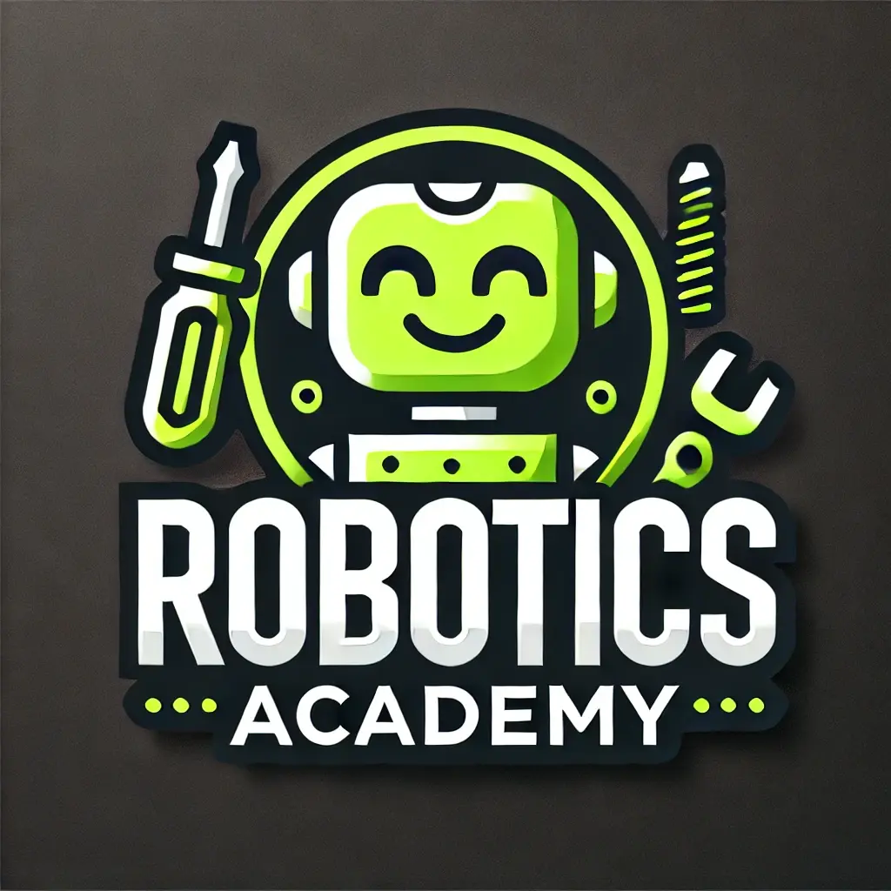
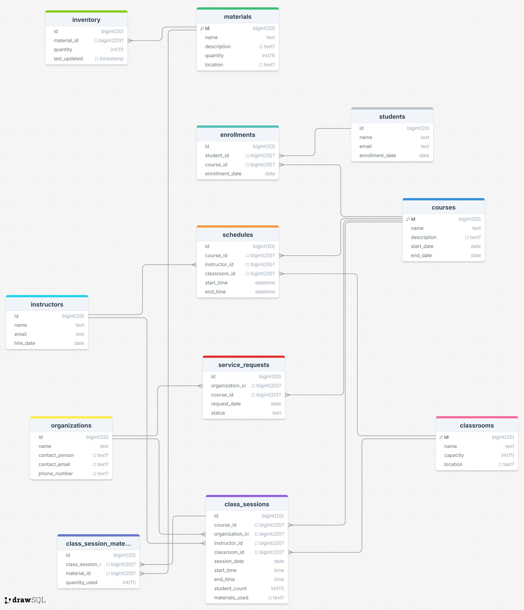

# 🤖 RoboTICs - Backend Project

This repository is part of a class project for the **Mobile Device Programming** course in the **Telecommunications Engineering Program** at **Unidades Tecnológicas de Santander (UTS)**. The goal of the project is to build the backend for a robotics academy called **RoboTICs**.

## 🧑‍💻 Project Members

- Santiago López
- Franz Amaya
- Jhon Vásquez
- Cristopher Fernández

## 🚀 Project Status

Currently, this repository contains only the structure of the **database** required for the operation of the **RoboTICs** robotics academy.

## 📊 Database Structure

  
<strong><i>📋 Tables</i></strong>

  
  **🧑‍🎓 Table: Students**
  
  - **Purpose**: Stores information about the students.
  - **Fields**:
    - `id`: Unique identifier for the student.
    - `name`: Student's name.
    - `email`: Unique email address of the student.
    - `enrollment_date`: Student's enrollment date.
  
  **📦 Table: Materials**
  
  - **Purpose**: Stores information about the available materials.
  - **Fields**:
    - `id`: Unique identifier for the material.
    - `name`: Material name.
    - `description`: Material description.
    - `quantity`: Available quantity of the material.
    - `location`: Material location.
  
  **📘 Table: Courses**
  
  - **Purpose**: Stores information about the offered courses.
  - **Fields**:
    - `id`: Unique identifier for the course.
    - `name`: Course name.
    - `description`: Course description.
    - `start_date`: Course start date.
    - `end_date`: Course end date.

*🏫 Table: Classrooms*
  
  - *Purpose*: Stores information about the available classrooms.
  - *Fields*:
    - id: Unique identifier for the classroom.
    - name: Classroom name.
    - capacity: Classroom capacity.
    - location: Classroom location.
  
  *⏰ Table: Schedules*
  
  - *Purpose*: Stores the schedules for the courses.
  - *Fields*:
    - id: Unique identifier for the schedule.
    - course_id: Reference to the scheduled course.
    - instructor_id: Reference to the assigned instructor.
    - classroom_id: Reference to the assigned classroom.
    - start_time: Course start time.
    - end_time: Course end time.
  
  *🏢 Table: Organizations*
  
  - *Purpose*: Stores information about associated organizations.
  - *Fields*:
    - id: Unique identifier for the organization.
    - name: Organization name.
    - contact_person: Contact person.
    - contact_email: Unique contact email address.
    - phone_number: Contact phone number.
=======
  **📑 Table: Service Requests**
  
  - **Purpose**: Records service requests from organizations.
  - **Fields**:
    - `id`: Unique identifier for the request.
    - `organization_id`: Reference to the requesting organization.
    - `course_id`: Reference to the requested course.
    - `request_date`: Request date.
    - `status`: Request status.
  
  **🕰️ Table: Class Sessions**
  
  - **Purpose**: Stores information about class sessions.
  - **Fields**:
    - `id`: Unique identifier for the class session.
    - `course_id`: Reference to the course of the session.
    - `organization_id`: Reference to the associated organization.
    - `instructor_id`: Reference to the session instructor.
    - `classroom_id`: Reference to the classroom used.
    - `session_date`: Session date.
    - `start_time`: Session start time.
    - `end_time`: Session end time.
    - `student_count`: Number of students present.
    - `materials_used`: Materials used in the session.
  
  **🛠️ Table: Class Session Materials**
  
  - **Purpose**: Records the materials used in each class session.
  - **Fields**:
    - `id`: Unique identifier for the record.
    - `class_session_id`: Reference to the class session.
    - `material_id`: Reference to the material used.
    - `quantity_used`: Quantity of material used.

  
<strong><i>🧩 Relationships</i></strong>

  
  - **Students** to **Enrollments**: A student can be enrolled in multiple courses (1:N).
  - **Courses** to **Enrollments**: A course can have multiple enrolled students (1:N).
  - **Materials** to **Inventory**: A material can be in multiple inventory records (1:N).
  - **Courses** to **Schedules**: A course can have multiple schedules (1:N).
  - **Instructors** to **Schedules**: An instructor can have multiple schedules (1:N).
  - **Classrooms** to **Schedules**: A classroom can have multiple schedules (1:N).
  - **Organizations** to **Service Requests**: An organization can make multiple service requests (1:N).
  - **Courses** to **Service Requests**: A course can be related to multiple service requests (1:N).
  - **Courses** to **Class Sessions**: A course can have multiple class sessions (1:N).
  - **Organizations** to **Class Sessions**: An organization can have multiple class sessions (1:N).
  - **Instructors** to **Class Sessions**: An instructor can have multiple class sessions (1:N).
  - **Classrooms** to **Class Sessions**: A classroom can have multiple class sessions (1:N).
  - **Class Sessions** to **Class Session Materials**: A class session can use multiple materials (1:N).
  - **Materials** to **Class Session Materials**: A material can be used in multiple class sessions (1:N).

## 📅 Next Steps

In future phases, we will begin to implement frameworks for the backend and integrate the database with the necessary services for the **RoboTICs** academy.
